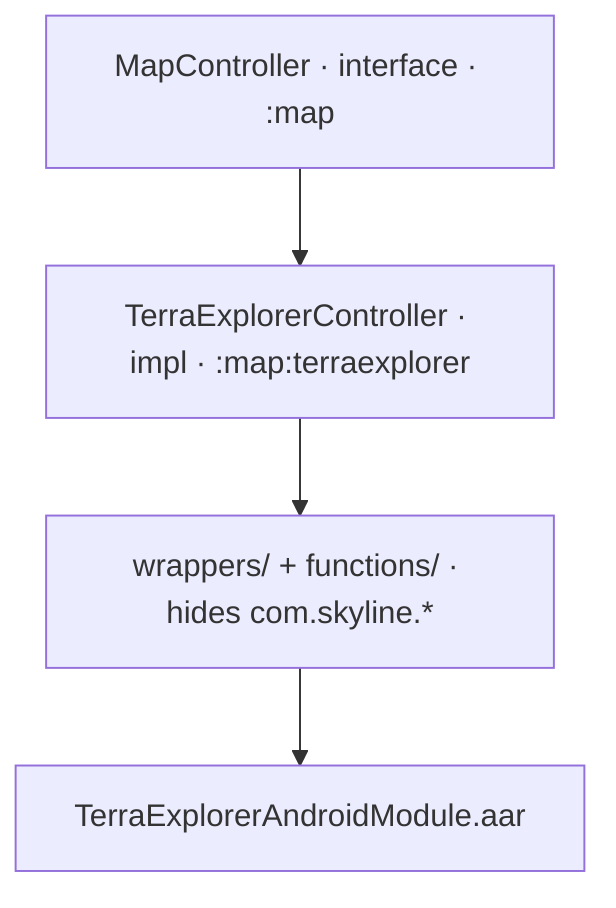

זהו יום 24 (חצי ראשון) — סיור-עצמי מודרך ב-alpha-mobile, שמסתיים בתרגיל ה-`CLAUDE.md`. אחרי פרויקט הגמר, כמעט כל מה שתראו כאן ירגיש כמו **"הגרסה התעשייתית של מה שבניתי"**. הישענו על התחושה הזו במפורש — היא הכוונה.

## מפת המודולים

```text
:app               — האפליקציה הראשית (com.even.alpha): core/ + feature/
:core              — עזרים משותפים (com.even.core)
:core:logger       — עטיפת Elastic APM + Logcat
:core:ui           — רכיבי UI משותפים
:map               — הפשטות מפה (com.even.map): MapController וה-types
:map:terraexplorer — אינטגרציית ה-AAR של TerraExplorer
```

כיוון התלות: `:app` יודע על `:map`, `:map` **לא** יודע על `:app`. `:map` מגדיר interface (`MapController`), ו-`:map:terraexplorer` מספק מימוש. זו אותה הפרדה שבניתם בקטן בפרויקט הגמר.

## המפה, ברצינות

השכבות שבניתן מהן צעצוע:



השוו ל-wrapper שלכם מפרויקט הגמר: **אותו רעיון, יותר פעולות.** `MapController.kt` חושף עשרות מתודות (listeners, layers, camera) במקום ארבע — אבל העיקרון זהה: שום דבר מעל ה-wrapper לא מכיר את ה-SDK. התבנית ההיברידית גם היא מוכרת: `TEView` בתוך `AndroidView`, ומעליו overlay של Compose.

## אנטומיית feature

עברו על שני features, מהפשוט לעשיר:

- **`feature/settings/`** — הפשוט: `SettingsViewModel.kt` (interface/abstract + `Impl`, `StateFlow<ScreenState>`), `SettingsScreen.kt` (ה-composable ה-stateless + `NavGraphBuilder.settingsRoute()`).
- **`feature/search/`** — העשיר: `SearchViewModel.kt` (ScreenState מקונן עם `sealed`, debounce), `SearchRepository.kt` (מיזוג רשת + מקומי + GeoPackage), `SearchModule.kt` (חיווט Koin).

> זו **אותה תבנית** כמו פרויקט הגמר שלכם — כי פרויקט הגמר תוכנן ממנה. אם משהו כאן לא ברור, חזרו ל[MVVM ו-Koin](/alpha-onboarding/foundations/mvvm-koin/); הוא נכתב מול בדיוק הקבצים האלה.

## core

- **`core/auth/`** — `AuthApi`, `AuthRepository`, `SsoProvider` (אלפא משתמשת ב-SSO).
- **`core/network/`** — `NetworkManager`, `AuthInterceptor` (זוכרים את ה-interceptor משלב 1?), `NetworkResult`.
- **`core/datastore/`** — **החלטת ה-DataStore הכפול**: in-memory (session) + persistent (preferences). שתי החנויות, שני תפקידים.
- **`core/navigation/Route.kt`** — ה-`sealed Route` היחיד לכל האפליקציה.
- **`core/ui/components/`** — רכיבי Compose משותפים (`CustomScaffold`, `Button`, `BottomDialog`...).

ועוד שלושה, שם + שורה (איפה להסתכל, לא איך הם עובדים):

- **Background services** — `DevicePollingService`, `VpnStatusService` (פעולות רקע).
- **Unleash** — feature flags בזמן ריצה (`io.getunleash`), בלי build מחדש.
- **Elastic APM** — תצפיתיות (`core/logger`, service name `"alpha-mobile"`).

## תרגיל ה-CLAUDE.md (המרכזי)

קראו את `CLAUDE.md` של alpha-mobile מההתחלה לסוף — עכשיו, כשכל מילה אומרת משהו. אחר כך, הציד: עבור **כל אחד** מארבעת כללי הצוות הבאים (מתוך **§5 Conventions** ו-**§2 Modules** ב-`CLAUDE.md`):

1. **`MutableStateFlow` פרטי** — ה-ViewModel חושף החוצה `StateFlow` בלבד.
2. **ניווט typed דרך `Route`** (sealed) — אף פעם לא ניווט מבוסס-מחרוזות.
3. **Koin מאותחל רק ב-`App.kt`** (החיווט עצמו ב-`AppModule`/`CoreModule`/`FeatureModule`).
4. **לעולם לא `Dispatchers.IO` ישירות** — מזריקים `DispatchersProvider` וקוראים `withContext(dispatchers.io)`.

מצאו: **(א)** מקום אחד בקוד שמקיים את הכלל (עם נתיב), ו**(ב)** נסו למצוא הפרה אחת או מקרה-גבול כלשהו (בדרך כלל יש לפחות אחד — `grep` מותר, AI במצב Navigator מותר). רמז למקרי-גבול אמיתיים: חפשו קריאה ישירה ל-`Dispatchers.IO`/`Dispatchers.Default` (במקום דרך `DispatchersProvider`), או `import com.skyline.*` מחוץ למודול `:map:terraexplorer` — §2/§6 אוסרים את שניהם. כתבו את הממצאים כהערה קצרה / gist לסקירת החופף.

**הגדרת סיום:** 4 דוגמאות חיוביות עם נתיבים + לפחות מקרה-גבול אמיתי אחד, מנומק.

## שאלות לסיור עם החופף

זה השלב "שאל את הצוות" בסולם, מתורגל. אחרי התרגיל, קבעו ישיבה של 30 דקות ושאלו 5 שאלות "למה" — התשובות הן ידע-צוות (team lore) שאין ב-AI:

1. למה interface+Impl על ViewModels, כש-Koin יכול לקשור מחלקות ישירות?
2. למה OkHttp גולמי ולא Retrofit?
3. למה Activity יחיד?
4. למה Unleash (feature flags בזמן ריצה) ולא קונפיגורציה בבילד?
5. למה DataStore כפול (in-memory + persistent)?

## למעבר הלאה

המשיכו (באותו יום) אל [סודות ושתי רשתות](/alpha-onboarding/alpha/secrets-networks/) — המודל שבו טעות נחפף יקרה, והסכנה בלתי-נראית עד שמסבירים אותה.

