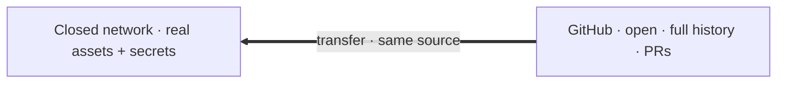

זהו יום 24 (חצי שני) — מודל שתי הרשתות ודיסציפלינת הסודות. זה התחום היחיד שבו טעות נחפף יקרה, והסכנה בלתי-נראית עד שמסבירים אותה. הטון כאן רציני אבל לא מפחיד: מדובר על **מערכות**, לא על האשמה. אחרי המסמך הזה תבינו בדיוק מה אסור שיחצה את הגבול, ולמה.

## שתי רשתות, מקור אחד

הצד הימני (**GitHub**): הפיתוח קורה כאן — היסטוריה מלאה, PRs רגילים, branch = dev. הצד השמאלי (**הרשת הסגורה**): צרכן downstream שמלביש assets/secrets אמיתיים מעל אותו מקור, ובונה את האפליקציה המבצעית.

**אותו מקור** נבנה בשתי הרשתות, נבחר על ידי המאפיין `alpha.connectivity` (`internal`/`external`, מוזרק מ-`local.properties`). אין "branch של infra", אין patches. ההבדל היחיד הוא איזו תיקיית `src/` נכנסת לבנייה (`src/internal` מול `src/external`) ואילו ערכי `alpha.*` מוזרקים.

## מה לעולם לא עוזב את הרשת הסגורה

- **`app/src/main/assets/*.gpkg` אמיתיים** — נתונים מבצעיים. בצד הפתוח אלה stubs ריקים (אלה שראיתם ב[תרגיל ה-GIS](/alpha-onboarding/alpha/domain-gis/)).
- **`app/keys/*.jks`** — חומר חתימה (signing).
- **`keystore-*.properties`** — סיסמאות חתימה.
- **ערכי `alpha.*` אמיתיים** — כתובות שרתים, מפתחי API, hosts פנימיים.

בצד הפתוח כל אלה ריקים/stubs **מתוך תכנון**: הצד הפתוח הוא snapshot מסונן של ה-dev הסגור — *נקי מעצם הבנייה*, לא תוצאה של מחיקת-היסטוריה. ערכי `alpha.*` האמיתיים **אינם ב-`gradle.properties` כלל**; הם חיים רק ב-`local.properties` המקומי (gitignored), כך שהם אף פעם לא נכנסים ל-git — והצד הפתוח פשוט לא נושא אותם.

## איך זה נאכף

הגנה לעומק (defense in depth):

1. **`scripts/internal/scan-sensitive.sh`** — מנוע הסריקה. רוצים לבדוק לפני push? הריצו אותו ידנית על ה-worktree.
2. **CI** מריץ את אותה סריקה על **כל push** — וזו האכיפה האמיתית. (hook מקומי אפשר לעקוף; את ה-CI לא.)

מה הסקריפט מסמן (כל אחד = כישלון קשיח):

- `.gpkg`/SQLite בגודל אמיתי (מעל סף ה-stub).
- חומר חתימה (`*.jks`, `*.keystore`...).
- קובצי credential (סיסמאות store/key).
- סודות שדלפו (gitleaks, אם מותקן).
- hosts פנימיים (לפי denylist).

> **כללים קשיחים (קופסה):**
> - **אל תנסו לעקוף את הסריקה.** היא קיימת בדיוק כדי למנוע את הטעות שאי אפשר לבטל; ה-CI סורק כל push בצד GitHub.
> - **לעולם אל תעשו commit לשום דבר מהרשת הסגורה** ללא זרימת הסנכרון.
> - **בספק — שאלו לפני ה-push.** הצוות ראה הכל; אין שאלה מביכה כאן, יש רק push שאי אפשר לבטל.
>
> כשה-scan חוסם אתכם: **קראו את ההודעה, אל תעקפו, שאלו.**

## הבילד החיצוני, עכשיו באמת

נסגור את הלולאה מיום 0: כש-`alpha.connectivity` חסר (אין `local.properties` אצלכם), הבילד נופל ל-`external` → מתקמפל `src/external` (mocks), `BuildConfig.IS_EXTERNAL = true`, שרתים מדומים / target מבודד. **זו הסיבה** שהאפליקציה רצה ביום הראשון שלכם בלי VPN ובלי keystores. לא היה שם קסם — היה שם תכנון.

## סנכרון (מודעות בלבד)

`scripts/sync.sh` מניע את ההעברה open↔closed (`package`/`apply`, `push`/`publish`). **נחפפים לא מריצים אותו** — אבל דעו שהוא קיים, כדי שהמילים יאמרו משהו ב-standup. הפרטים ב-`scripts/README.md`.

## תרגיל (קצר, קריאה בלבד)

קראו את הערות הכותרת של `scripts/internal/scan-sensitive.sh` ואת חלק ה"model" ב-`scripts/README.md`. אחר כך ענו בכתב, לחופף, על שלוש שאלות:

1. מה קורה אם בטעות עשיתם `git add` ל-`.gpkg` אמיתי ו-push?
2. למה ערכי `alpha.*` האמיתיים אינם בריפו בכלל, ואיפה כן מקומם?
3. איפה נאכפת הסריקה לתוכן רגיש (רמז: לא ב-hook מקומי), ואיך תריצו אותה ידנית לפני push?

**הגדרת סיום:** שלוש תשובות נכונות.

## למעבר הלאה

המשיכו אל [המשימה האמיתית הראשונה](/alpha-onboarding/alpha/first-ticket/) — המבחן האחרון של התוכנית: עבודה אמיתית, מפוקחת.

