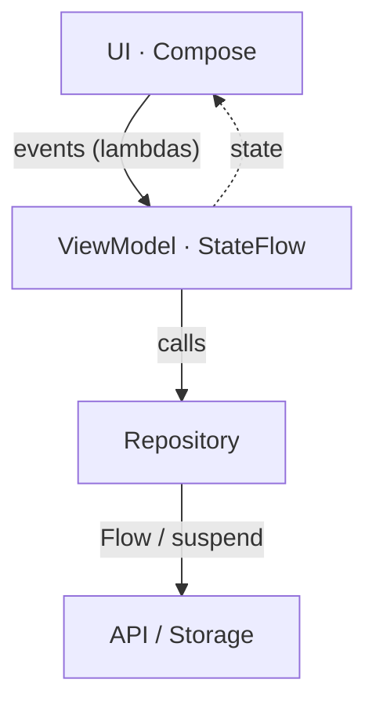

import VideoLink from '../../../components/VideoLink.astro';

זה המסמך שמולו ייבדק פרויקט הגמר. כאן לא נלמד תיאוריה כללית אלא את **הארכיטקטורה המדויקת** של הצוות, מול הקוד האמיתי של alpha-mobile. אם הפנמתם את ה-coroutines ואת Compose, כל החלקים כאן מתחברים לתמונה אחת.

<VideoLink
  url="https://www.youtube.com/watch?v=9sqvBydNJSg"
  title="ViewModels & Configuration Changes - Android Basics"
  channel="Philipp Lackner"
  duration="18 דק׳"
  why="מסביר למה ViewModel שורד סיבוב מסך — הבסיס הקונספטואלי לפני שניגשים לתבנית המדויקת של הצוות."
  segment="הקונספט הכללי של ViewModel (לא תבנית ה-interface+Impl/StateFlow או Koin — אלה הייחוד של הצוות, במסמך עצמו)."
/>

## התמונה הגדולה

זרימת נתונים חד-כיוונית (Unidirectional Data Flow):



> **גשר:** זה Redux בלי ה-boilerplate. ה-ViewModel הוא ה-store+reducers של מסך אחד; `ScreenState` הוא צורת ה-state; ה-events הם ה-actions. ההבדל: אין dispatch מפורש ואין middleware — קוראים למתודה על ה-ViewModel, היא מעדכנת `_state`, וה-UI מתרנדר מחדש.

## ה-ViewModel בתבנית של הצוות

התבנית המדויקת מ-`CLAUDE.md`. נתחיל מהפשוט — `SettingsViewModel.kt`:

```kotlin
abstract class SettingsViewModel : ViewModel() {
    data class ScreenState(
        val displayName: String,
        val role: String,
        val unit: String,
    )
    abstract val state: StateFlow<ScreenState>
    abstract fun logout()
}

class SettingsViewModelImpl(
    private val navigator: Navigator,
    private val ssoProvider: SsoProvider,
    private val forceRepository: ForceRepository,
) : SettingsViewModel() {
    private val mutableState = MutableStateFlow(ScreenState("", "", ""))
    override val state: StateFlow<ScreenState> get() = mutableState

    override fun logout() = ssoProvider.logout()
}
```

(בקוד הצוות תראו גם interface + class וגם, כמו כאן, `abstract class` + `Impl` — שתי הצורות מקובלות; העיקרון זהה: חוזה מופרד ממימוש.)

הדוגמה העשירה יותר, `SearchViewModel.kt`, מוסיפה `ScreenState` מקונן עם `sealed interface` (מצבי `Initial`/`Loading`/`PartiallyLoaded`/`Loaded`), debounce על קלט, ועדכוני state דרך `update { it.copy(...) }`. שווה לקרוא אותה לצד ה-Settings — אותה תבנית, מורכבות אמיתית.

> **כללים קשיחים (קופסה — מ-`CLAUDE.md`):**
> - לעולם אל תחשפו `MutableStateFlow` — רק `StateFlow` immutable.
> - לעולם לא ניווט מבוסס-מחרוזות — תמיד `Route`.
> - ה-state הוא `data class` אחד immutable; מעדכנים דרך `copy()`.
> - backing state בקידומת קו תחתון: `_state` / `mutableState`.

## Repository

interface + Impl, בדיוק כמו ה-ViewModel. streams נחשפים כ-`Flow<T>`; פעולות חד-פעמיות כ-`suspend fun`. ה-exemplar הוא `SearchRepository.kt`, שממזג מקורות (מכשירים מקומיים + רשת + GeoPackage) לתוך `Flow<SearchState>` אחד:

```kotlin
interface SearchRepository {
    suspend fun search(filter: String): Flow<SearchState>
}
class SearchRepositoryImpl(
    private val searchApi: SearchApi,
    private val geoPackageProvider: GeoPackageProvider,
    private val dispatchers: DispatchersProvider,
) : SearchRepository { /* ... */ }
```

שימו לב: התלויות נכנסות דרך ה-constructor. זה מוביל ישר ל-Koin.

## Koin מגושר מ-Nest

זה הגשר השני-הכי-טוב בתוכנית. אם הבנתם dependency injection ב-NestJS, Koin יתיישב מהר:

| NestJS | Koin |
|---|---|
| `@Injectable()` + `providers: [...]` | `factoryOf(::Impl) bind Interface::class` |
| constructor injection | constructor injection (זהה) |
| `imports: [OtherModule]` | `includes(otherModule)` |
| scope singleton (ברירת מחדל) | `single { }` (מפורש) |
| provider חולף | `factory { }` |
| — (אין מקבילה ישירה) | `viewModelOf(::Impl)` ל-ViewModels |

דוגמאות אמיתיות מהקוד:

```kotlin
// FeatureModule.kt
val featureModule = module {
    includes(loginModule, mapModule, searchModule, /* ... */)
    viewModelOf(::SettingsViewModelImpl) bind SettingsViewModel::class
}

// SearchModule.kt
val searchModule = module {
    viewModelOf(::SearchViewModelImpl) bind SearchViewModel::class
    factoryOf(::SearchRepositoryImpl) bind SearchRepository::class
}
```

המודולים הראשיים: `AppModule.kt`, `CoreModule.kt`, `FeatureModule.kt` (כל אחד מרכיב תת-מודולים דרך `includes()`).

> **כללי הצוות:**
> - רשמו כל תלות במודול הנכון (core מול feature).
> - **אין `KoinComponent` בקוד production** — העדיפו constructor injection. (תראו `KoinComponent` בכמה מקומות ישנים כמו `SearchViewModelImpl` — זה בדיוק החריג שה-`CLAUDE.md` ממליץ להימנע ממנו; אל תחקו אותו בקוד חדש.)
> - ב-route, מקבלים את ה-ViewModel דרך `koinViewModel<>()`.

## ניווט

`Route` הוא `sealed interface` (קובץ `core/navigation/Route.kt`), וכל feature מוסיף route דרך extension function על `NavGraphBuilder`:

```kotlin
fun NavGraphBuilder.settingsRoute() {
    composable<Route.Settings> {
        val vm = koinViewModel<SettingsViewModel>()
        val state by vm.state.collectAsState()
        Settings(displayName = state.displayName, onLogout = vm::logout)
    }
}
```

> **גשר:** מול מחרוזות ה-route של react-router, כאן **הקומפיילר הוא ה-route guard**. `Route.Settings` הוא טיפוס; שגיאת כתיב לא תתקמפל, ופרמטרים של route הם type-safe.

## טסטים בתבנית הצוות

הטסטים יורשים מ-`TestSetup` (שמקים Koin עם מודולי האפליקציה ומאפשר override), משתמשים ב-`declareMock<T> { }`, ב-`MockGenerator` לנתונים מדומים, ובקיבוץ עם `@Nested`. נעבור על טסט אמיתי אחד מ-`SearchViewModelTest.kt`:

```kotlin
@Test
fun `Change text input fetch search results after debounce`() = runTest {
    searchVM.onInputTextChange("ss")                          // 1. מפעילים אירוע

    assertIs<SearchMode.Basic.Loading>(searchVM.state.value.searchMode)  // 2. state ביניים

    advanceUntilIdle()                                        // 3. מריצים את ה-debounce

    assertEquals(                                             // 4. בודקים את ה-state הסופי
        desiredTitleList,
        (searchVM.state.value.searchMode as SearchMode.Basic.Loaded).results.map { it.title },
    )
}
```

כל שורה: (1) מפעילה אירוע על ה-ViewModel, (2) מאמתת מעבר ל-state ביניים, (3) מקדמת את הזמן הווירטואלי כדי לעבור את ה-debounce, (4) מאמתת את ה-state הסופי. זו התבנית שתחזרו עליה בכל טסט ViewModel בפרויקט הגמר.

## קריאת חובה

- [ViewModel overview](https://developer.android.com/topic/libraries/architecture/viewmodel) ב-developer.android.com.
- [Koin definitions](https://insert-koin.io/docs/reference/koin-core/definitions/) — `single` / `factory` / `viewModelOf`.
- וקראו **שוב** את החלק "Architecture Patterns" ב-`CLAUDE.md` של alpha-mobile — עכשיו, כשכל מילה בו אומרת משהו.

## תרגיל

אין תרגיל כאן — [המסמך הבא](/alpha-onboarding/foundations/gate1/) הוא התרגיל: מבחן מדרגה 1.

## למעבר הלאה

המשיכו אל [תרגיל הסיכום — מבחן מדרגה 1](/alpha-onboarding/foundations/gate1/). הוא מודד שכל מה שבנינו עד כה נחת.

